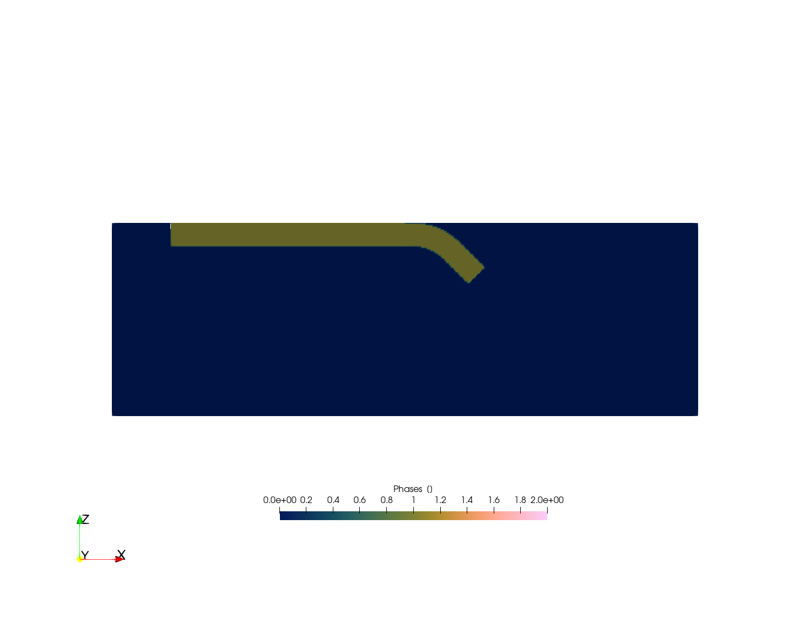
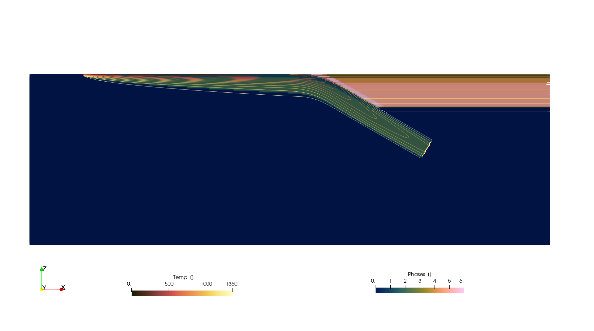

```@meta
EditURL = "../../../tutorials/Tutorial_NumericalModel_2D.jl"
```

# Creating 2D numerical model setups

### Aim
The aim of this tutorial is to show you how to create 2D numerical model setups that can be used as initial setups for other codes.

### 2D Subduction setup

Lets start with creating a 2D model setup in cartesian coordinates, which uses the `CartData` data structure

```julia
using GeophysicalModelGenerator

nx,nz = 512,128
x = range(-1000,1000, nx);
z = range(-660,0,    nz);
Grid2D = CartData(xyz_grid(x,0,z))
```

````
CartData 
    size    : (512, 1, 128)
    x       ϵ [ -1000.0 : 1000.0]
    y       ϵ [ 0.0 : 0.0]
    z       ϵ [ -660.0 : 0.0]
    fields  : (:Z,)

````

Now we create an integer array that will hold the `Phases` information (which usually refers to the material or rock type in the simulation)

```julia
Phases = zeros(Int64, nx, 1, nz);
```

In many (geodynamic) models, one also has to define the temperature, so lets initiate it

```julia
Temp = fill(1350.0, nx, 1, nz);
```

#### Mechanical setup

We will start with a simple subduction setup, which consists of a horizontal part:

```julia
add_box!(Phases, Temp, Grid2D; xlim=(-800,0.0), zlim=(-80.0, 0.0), phase = ConstantPhase(1));
```

And with the inclined part:

```julia
add_box!(Phases, Temp, Grid2D; xlim=(0,300), zlim=(-80.0, 0.0), phase = ConstantPhase(1), DipAngle=30);
```

Add them to the `CartData` dataset:

```julia
Grid2D = addfield(Grid2D,(;Phases, Temp))
```

````
CartData 
    size    : (512, 1, 128)
    x       ϵ [ -1000.0 : 1000.0]
    y       ϵ [ 0.0 : 0.0]
    z       ϵ [ -660.0 : 0.0]
    fields  : (:Z, :Phases, :Temp)

````

Which looks like

```julia
write_Paraview(Grid2D,"Grid2D_SubductionMechanical");
```

````
Saved file: Grid2D_SubductionMechanical.vts

````


#### Add lithospheric layers
In many geodynamic models, the lithosphere consists of a crust and mantle (or upper crust, lower crust and mantle lithosphere).
We can use the function `LithosphericPhases` for this, which is a simple way to set a lithospheric layering. The layering here is defined by the `Layers` and `Phases` arguments, where `Layers` is a vector of the thickness of each of the layers (counting from the top) and `Phases` is a vector of the phase numbers for each layer.

```julia
lith = LithosphericPhases(Layers=[15 55], Phases=[1 2])
```

````
LithosphericPhases([15 55], [1 2], nothing)
````

and set the slab again:

```julia
add_box!(Phases, Temp, Grid2D; xlim=(-800,0.0), zlim=(-80.0, 0.0), phase = lith);
add_box!(Phases, Temp, Grid2D; xlim=(0,300), zlim=(-80.0, 0.0), phase = lith, DipAngle=30);
```

Which looks like:

```julia
Grid2D = addfield(Grid2D,(;Phases, Temp))
write_Paraview(Grid2D,"Grid2D_SubductionMechanicalLayered");
```

````
Saved file: Grid2D_SubductionMechanicalLayered.vts

````


#### Add halfspace cooling thermal structure
So far, we only created the mechanical structure but not the thermal one.
We can do that by specifying a thermal structure. For example, we can use the half-space cooling model:

```julia
therm = HalfspaceCoolingTemp(Age=40)
add_box!(Phases, Temp, Grid2D; xlim=(-800,0.0), zlim=(-80.0, 0.0), phase = lith, T=therm);
add_box!(Phases, Temp, Grid2D; xlim=(0,300), zlim=(-80.0, 0.0), phase = lith, T = therm, DipAngle=30);
```

Which looks like:

```julia
Grid2D = addfield(Grid2D,(;Phases, Temp))
write_Paraview(Grid2D,"Grid2D_SubductionHalfspaceCooling");
```

````
Saved file: Grid2D_SubductionHalfspaceCooling.vts

````


Note that you can specify other 1D thermal profiles, such as
- `ConstantTemp`
- `LinearTemp`
- `HalfspaceCoolingTemp`
- `LithosphericTemp`  - which takes radioactive heating into account
- `SpreadingRateTemp` - which assumes that the plate moved away from a ridge and the thermal age increased accordingly
- `McKenzie_subducting_slab` - temperature of a slab that is heated by surrounding mantle

You can also average 1D profiles:
- `LinearWeightedTemperature` - Average 2 1D profiles along a distance

#### Add a ridge
Let's specify an oceanic thermal profile with a mid oceanic ridge at the left. For this, we use the `SpreadingRateTemp` function, and specify
a spreading velocity (note that this simply relates to the thermal structure and does not have to be the same as the subduction velocity you obtain in your geodynamic simulation).

```julia
lith = LithosphericPhases(Layers=[15 55], Phases=[1 2], Tlab=1250)
add_box!(Phases, Temp, Grid2D; xlim=(-800,0.0), zlim=(-80.0, 0.0), phase = lith, T=SpreadingRateTemp(SpreadingVel=3));
```

For the subduction we use a thermal structure of a slab heated by hot asthenosphere

```julia
add_box!(Phases, Temp, Grid2D; xlim=(0,300), zlim=(-80.0, 0.0), phase = lith, T = McKenzie_subducting_slab(Tsurface=0,v_cm_yr=3), DipAngle=30);
```

We can set the mantle lithosphere that is hotter > 1250 C to mantle:

```julia
ind = findall(Temp .> 1250 .&& Phases .==2);
Phases[ind] .= 0;

Grid2D = addfield(Grid2D,(;Phases, Temp))
write_Paraview(Grid2D,"Grid2D_SubductionRidge");
```

````
Saved file: Grid2D_SubductionRidge.vts

````


#### Overriding slab and weak layer
Ok, lets add an overriding slab as well. For this, we use the `AddLayer!` function

```julia
lith = LithosphericPhases(Layers=[15 20 55], Phases=[3 4 5], Tlab=1250)
add_box!(Phases, Temp, Grid2D; xlim=(0,1000), zlim=(-80.0, 0.0), phase = lith, T=HalfspaceCoolingTemp(Age=80));
```

The oceanic plate is as before

```julia
lith = LithosphericPhases(Layers=[15 55], Phases=[1 2], Tlab=1250)
add_box!(Phases, Temp, Grid2D; xlim=(-800,0.0), zlim=(-80.0, 0.0), phase = lith, T=SpreadingRateTemp(SpreadingVel=3));
```

For the inclined part, we set a layer above the slab (the "weak" layer to facilitate subduction initiation )

```julia
lith = LithosphericPhases(Layers=[10 15 55], Phases=[6 1 2], Tlab=1250)
add_box!(Phases, Temp, Grid2D; xlim=(0,300), zlim=(-80.0, 10.0), phase = lith, T = McKenzie_subducting_slab(Tsurface=0,v_cm_yr=3), DipAngle=30);
```

Lithosphere-asthenosphere boundary:

```julia
ind = findall(Temp .> 1250 .&& Phases .==2);
Phases[ind] .= 0;

Grid2D = addfield(Grid2D,(;Phases, Temp))
write_Paraview(Grid2D,"Grid2D_SubductionOverriding");
```

````
Saved file: Grid2D_SubductionOverriding.vts

````


#### Curved slab - mechanics
So far, the subducting part of the slab was always straight. We can also create a curved slab by using the `add_slab!` function. This uses a parametric representation of the slab and is a bit more involved than the `add_box!` function.

We start with the horizontal part:

```julia
nx,nz = 512,128
x = range(-1000,1000, nx);
z = range(-660,0,    nz);
Grid2D = CartData(xyz_grid(x,0,z))
Phases = zeros(Int64, nx, 1, nz);
Temp = fill(1350.0, nx, 1, nz);
add_box!(Phases, Temp, Grid2D; xlim=(-800,0.0), zlim=(-80.0, 0.0), phase = ConstantPhase(1));
```

Next, we should define a `Trench` structure, which contains info about the trench which goes in 3D from `Start` - `End` coordinates (`x`,`y`)-coordinates respectively. As we are dealing with a 2D model, we set the `y`-coordinates to -100.0 and 100.0 respectively.
Other parameters to be specified are `Thickness` (Slab thickness), `θ_max` (maximum slab dip angle), `Length` (length of slab), and `Lb` length of bending zoneof slab

```julia
trench = Trench(Start=(0.0,-100.0), End=(0.0,100.0), Thickness=80.0, θ_max=45.0, Length=300, Lb=200, direction=-1.0);
add_slab!(Phases, Temp, Grid2D, trench, phase = ConstantPhase(1));
```

Add them to the `CartData` dataset:

```julia
Grid2D = addfield(Grid2D,(;Phases, Temp))
write_Paraview(Grid2D,"Grid2D_SubductionCurvedMechanical");
```

````
Saved file: Grid2D_SubductionCurvedMechanical.vts

````



#### Curved slab - thermo-mechanics
The `add_slab!` function has a few more interesting options. You can, for example, specify a weak decoupling layer above the slab which adds a weak layer between the subducting and overriding slab.
You can also indicate a thermal structure for the slab, which can increase from a halfspace cooling model (of the horizontal part of the slab) to a slab that is heated by the surrounding mantle below a decouping depth `d_decoupling`.

Our starting basis is the example above with ridge and overriding slab

```julia
nx,nz = 512,128
x = range(-1000,1000, nx);
z = range(-660,0,    nz);
Grid2D = CartData(xyz_grid(x,0,z))
Phases = zeros(Int64, nx, 1, nz);
Temp = fill(1350.0, nx, 1, nz);
lith = LithosphericPhases(Layers=[15 20 55], Phases=[3 4 5], Tlab=1250)
```

````
LithosphericPhases([15 20 55], [3 4 5], 1250)
````

Lets start with defining the horizontal part of the overriding plate. Note that we define this twice with different thickness to deal with the bending subduction area:

```julia
add_box!(Phases, Temp, Grid2D; xlim=(200,1000), zlim=(-150.0, 0.0), phase = lith, T=HalfspaceCoolingTemp(Age=80));
add_box!(Phases, Temp, Grid2D; xlim=(0,200), zlim=(-50.0, 0.0), phase = lith, T=HalfspaceCoolingTemp(Age=80));
```

The horizontal part of the oceanic plate is as before:

```julia
v_spread_cm_yr = 3      #spreading velocity
lith = LithosphericPhases(Layers=[15 55], Phases=[1 2], Tlab=1250)
add_box!(Phases, Temp, Grid2D; xlim=(-800,0.0), zlim=(-150.0, 0.0), phase = lith, T=SpreadingRateTemp(SpreadingVel=v_spread_cm_yr));
```

Yet, now we add a trench as well. The starting thermal age at the trench is that of the horizontal part of the oceanic plate:

```julia
AgeTrench_Myrs = 800e3/(v_spread_cm_yr/1e2)/1e6    #plate age @ trench
```

````
26.666666666666668
````

We want to add a smooth transition from a halfspace cooling 1D thermal profile to a slab that is heated by the surrounding mantle below a decoupling depth `d_decoupling`.

```julia
T_slab = LinearWeightedTemperature( F1=HalfspaceCoolingTemp(Age=AgeTrench_Myrs), F2=McKenzie_subducting_slab(Tsurface=0,v_cm_yr=v_spread_cm_yr, Adiabat = 0.0))
```

````
LinearWeightedTemperature(0.0, 1.0, 100.0, :X, HalfspaceCoolingTemp(0, 1350, 26.666666666666668, 0), McKenzie_subducting_slab(0.0, 1350.0, 0.0, 3.0, 1.0e-6, 36))
````

in this case, we have a more reasonable slab thickness:

```julia
trench = Trench(Start=(0.0,-100.0), End=(0.0,100.0), Thickness=90.0, θ_max=30.0, Length=600, Lb=200,
                WeakzoneThickness=15, WeakzonePhase=6, d_decoupling=125);
add_slab!(Phases, Temp, Grid2D, trench, phase = lith, T=T_slab);
```

Lithosphere-asthenosphere boundary:

```julia
ind = findall(Temp .> 1250 .&& (Phases.==2 .|| Phases.==5));
Phases[ind] .= 0;

Grid2D = addfield(Grid2D,(;Phases, Temp))
write_Paraview(Grid2D,"Grid2D_SubductionCurvedOverriding");
```

````
Saved file: Grid2D_SubductionCurvedOverriding.vts

````

The result is a smooth transition in thermal structure around the subduction zone:


### Other geometries
We have a number of other functions to help create a geometry, specifically:

- `AddLayer!`
- `AddSphere!`
- `AddEllipsoid!`
- `AddCylinder!`

The help functions are quite self-explanatory, so we won't show it in detail here.
If you have a topography surface or any other horizontal surface, you can surface with the cartesian grid with `above_surface` or `below_surface`.

Also, if you wish to take a seismic tomography as inspiration to set a slab geometry, you can interpolate it to a `CartGrid` with the same dimensions and use that with the julia `findall` function.

---

*This page was generated using [Literate.jl](https://github.com/fredrikekre/Literate.jl).*

